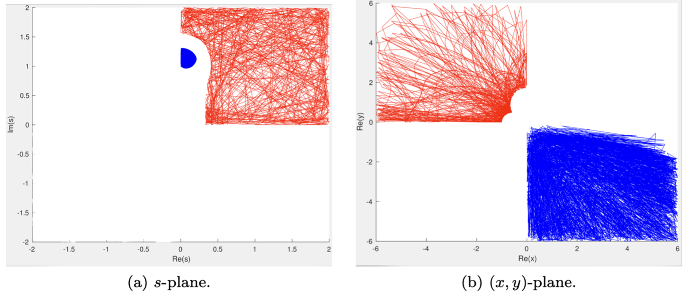

# Three-dimensional exponential asymptotics and Stokes surfaces for flows past a submerged point source

**Authors:** Yyanis Johnson-Llambias and Philippe H. Trinh (University of Bath)

## Supplemental data 

The following serves as a supplementary document providing explanatory notes and additional numerical computations used to generate some of the figures from manuscript, and in particular, Fig. 3. This figure illustrates the recovery of the physically relevant branches of the singulant function $\chi$, using a numerical continuation scheme originating in parameter, $s$, space. Since this is a numerical approach to the problem seen in Lustri & Chapman (2013), the analytical results of this work tells us there are eight branches to recover.

There is a further internal technical report given in `pdf/linear-report.pdf`. 

### Algorithm II and the random walks

The script `SPlaneWalk.m`  implements a continuation scheme which recovers the branches and reveals this relationship between the parameter domain $s$ and the physical domain by solving Charpit's equations. Upon performing this scheme, it quickly became clear that the correspondence between points in $s$ space and solutions for chi in $(x,y)$ space is nontrivial, with distinct regions of the $s$ plane recovering distinct sections of solution branches for $\chi$.  The boundaries correspond to singularities in the solution of Charpit's equation.


 
The important consequence is that one cannot simply recover an entire solution branch of $\chi$ by starting in $s$ and trivially covering an arbitrary large section of the $s$ plane; an unknowing step into a different region of $s$ space may produce a discontinuous transition to another branch of $\chi$. 

The need to recover solution branch sections in a systematic way motivates the random-walk scheme (Algorithm II discussed in the manuscript). Broadly, this implementation involves the following steps: 

1.	Pick a point in $s$ space, find the corresponding points x,y, chi through solving Charpit’s equations.
2.	Pick a nearby point in $s$ space, repeat step 1.
3.	Continue steps 1 and 2 until the solver encounters a boundary (a branch cut in $s$-space). 
4.	Terminate the continuation scheme solver after a given number of step. 

It can be shown analytically that as a boundary is approached in $s$ space the corresponding value of $\mathrm{max}(|x|, |y|) \to\infty$. Therefore in step 3, the solver can be considered as encountering a boundary by monitoring the given norm and verifying if it exceeds a prescribed threshold, $L$. Generally, the larger the value $L$, the more closely the scheme will reach the boundary before changing direction. However this comes at the cost of computation time.

Doing this for a trivially small number of steps and plotting the walk path in $s$ and $(x,y)$ yields an example such as the one below. 


 
Observing the above image, we see that scheme encounters the boundary and multiple points, then changes direction a few times. For a high number of steps, the locus of the points at which the solver changes direction will approximate a domain boundary (cf. fig 6 in article, fig.1 and 3 in `pdf/linear-report.pdf`).

### Instructions

The scheme above is implemented in `SPlaneWalk.m`, and the data is generated in the following steps:

1.	Open `SPlaneWalk.m` . Choose a value of (y0-sign, p0-sign) = (+,+), (+,-), (-, +), (-,-) and initial point in s space. This will determine which branch of chi we land on according to (5.5) and (5.10). Set a step size $\delta$ and number of iterations $Nmax$ after which the scheme will terminate. Run `SPlaneWalk.m` (this executes the algorithm above). 

2.	For the chosen value of (y0-sign, p0-sign) re-run the script `SPlaneWalk.m` using a few different choices of starting points $s_0$. Plotting `Re(XX)` vs `Re(YY)` after performing step 1 with `s_0 = 0.001+ i` (blue) `s_0 = 1 + 0.001i` (red) are shown below. [(y0-sign, p0-sign) = (+,+), Nmax= 600, delta =0.1, L = 6]



 
Upon inspection we can see that starting in the blue and red regions of s space correspond to (distinct) solution branches of chi in the 2nd and 4th quadrants in real-(x,y) space respectively. 

3.	Repeat steps 1 and 2 for all choices of (y0-sign, p0-sign). 

Note that there are two options to obtain complete pictures of all eight solution branches. Either

* We can exhaustively choose initial points $s_0$ in step 2 to ensure the entirety of every solution in each quadrant is obtained, or;
* We can stop as soon as in every quadrant we have obtained all solution branches that are equivalent modulo conjugation, and simply obtain the other branches using the conjugacy relations (5.13). 

For the sake of brevity, we took the latter approach (for data see `Data` section below). We then reconstruct the sections of each branch manually in a patchwork manner, and verify the solutions agree with the results of Lustri and Chapman (2013).

The result of this patchwork procedure for one such solution branch $chi_L1$ can be seen below. In this, each implementation of `SPlaneWalk.m` with appropriate choices of (y0-sign, p0-sign), s_0 are indicated as distinct colours.


Another branch $\chi_{T1}$ is plotted below.


 
## Data 

The data is saved in `data/walks/linear`.

In this folder there are 4 subfolders according to the value of (y0-sign, p0-sign):

| Pos | (+ , +) |
| --- | ------- | 
| neg | (- , -) |
| yneg |  (- , + ) |
| pneg |( + , - ) | 

Within each folder there are a several data files each obtained by an execution of `SPlaneWalk.m`. The naming convention is:

`‘w’,[starting point s_0] _ ’L’  [the (x,y,) domain size defined by L ] _ N, [The number of iterations of the stepper defined by Nwalks] .mat` 

Within each file, the most important data is:

```
SS =  matrix of points in S space
XX = matrix of x coordinates
YY = matrix of x coordinates
CHICHI = matrix of chi values
```


